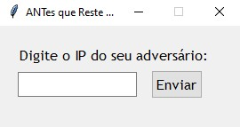
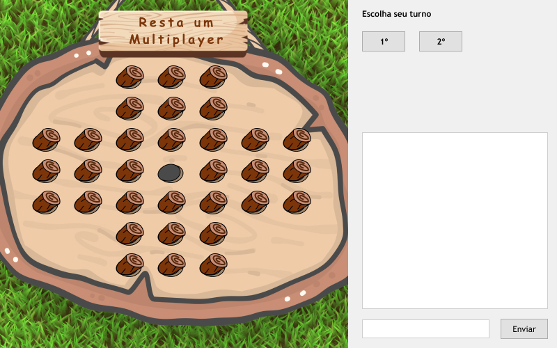
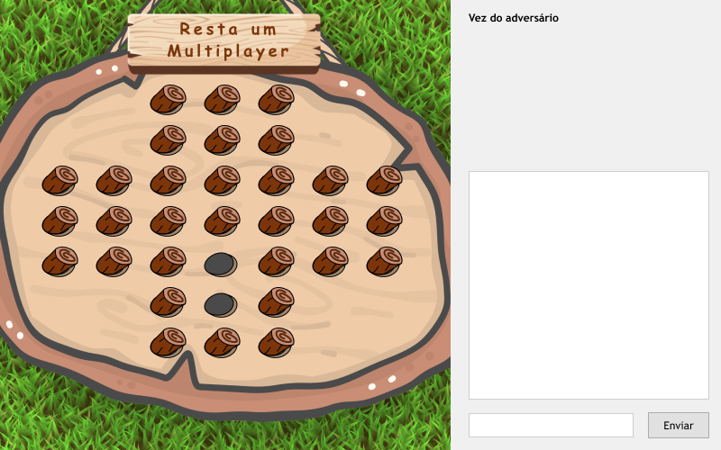
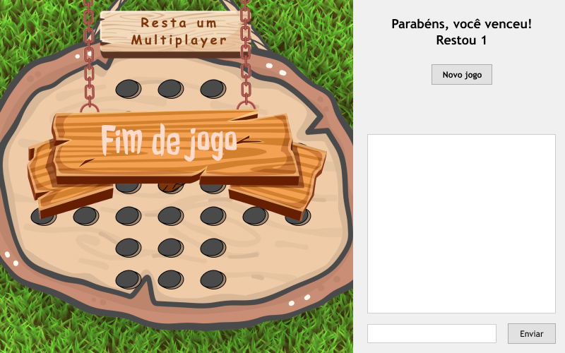

#  ANTes que reste uma 

Jogo de tabuleiro "Resta Um" - Multiplayer

## Índice

  * [Como jogar](#como-jogar)
    * [Definição do adversário](#definição-do-adversário)
    * [Gameplay](#gameplay)
    * [Fim de Jogo](#fim-de-jogo)
    * [Condições de vitória](#condições-de-vitória)
  * [Detalhes Técnicos](#detalhes-técnicos)
    * [Tecnologias utilizadas](#tecnologias-utilizadas)
    * [Comunicação via *sockets*](#comunicação-via-sockets)
      * [Comunicação do Jogo](#comunicação-do-jogo)
      * [Comunicação do Chat](#comunicação-do-chat)

## Como jogar
### Definição do adversário
Ao abrir o jogo abrirá uma tela (abaixo) onde será pedido para você informar o endereço de IP do computador que irá ser seu adversário, entre com o IP no formato "255.255.255.255" e clique em "Enviar"

Caso o IP iformado seja válido, seguiremos para a proxima tela

### Gameplay
Na parte inferior direita da tela há uma entrada de texto, onde se pode enviar mensagens para o adversário.
Na caixa acima, é possivel observar o histórico de conversas com o oponente.

Use o chat para decidir com o adversário quem irá iniciar o jogo, e segundo o que decidirem, clique no Botão que representa a sua decisão (parte superior a direita, "1º" caso você comece ou "2º" caso contrário), o jogo so iniciará quando as respostas de ambos forem compatíveis.

Após decidirem quem irá iniciar a partida, as peças do tabuleiro estarão disponíveis para a pessoa do turno atual realizar a jogada.
Para jogar clique na peça que você deseja movimentar, ela será selecionada (caso queira remover a seleção basta clicar novamente na mesma peça), em seguida clique na peça que deseja remover.
O turno só será passado para o próximo quando uma jogada válida for realizada.

  
  

### Fim de Jogo
O jogo acaba quando resta apenas uma peça no tabuleiro, ou quando não é mais possivel realizar jogadas. Ao clicar no botão "Novo Jogo" a fase de decisão de turnos será iniciada novamente para iniciar uma nova partida.

#### Condições de vitória
- Vence aquele realiza a jogada em que resta apenas uma peça no tabuleiro.
- Perde o jogador que realizar a jogada em que não é mais possível continuar o jogo e restar mais de uma peça no tabuleiro.

## Detalhes Técnicos

### Tecnologias utilizadas

A aplicação foi desenvolvida utilizando 
com as bibliotecas:
  - **Threading**: para gerar threads concorrentes;
  - **Tkinter**: para interface gráfica;
  - **Sockets**: para comunicação online, tanto para a troca de mensagens no chat, quanto para o movimento das peças entre oponentes.
  - **PyInstaller**: para a geração do arquivo executável.

### Comunicação via *sockets*

Com o uso da biblioteca [sockets](https://docs.python.org/3/library/socket.html) foram iniciadas duas conexões, uma para comunicação do Chat, e outra para a troca de lances e escolha de turno entre os oponentes.

Ambas as comunicações foram feitas através da Arquitetura p2p (ponto a ponto), não sendo necessária uma maquina intermediária para realizar a comunicação nem aplicações de código fonte distintos para cada usuário.

#### Comunicação do Jogo
  Para a troca de lances do jogo foi utilizada a porta "1234".
  Ao inicializar a Interface Gráfica é criada uma Thread que escuta a porta de recebimento de lances/turno (1234) que é interrompida quando o usuário faz um lance que causa o fim de um **jogo**, enviando um sinal para o adverário tambem finalizar a Thread de recebimento de lances, e reinicializada ao botão "Novo jogo" ser pressionado.

#### Comunicação do Chat
  Para o chat do jogo foi utilizada a porta "4321".
  Ao inicializar a Interface Gráfica é criada uma Thread com acesso aos componentes gráficos do campo de histórico de mensagens, que permanece escutando a porta de recebimento de mensagens (4321) do endereço local durante todo o tempo de vida ativa da aplicação.
